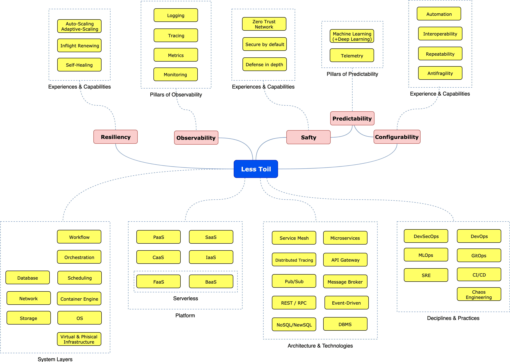

# NoOps Japan Community

NoOps Japan is a community for sharing knowledge and experience across platforms and technologies to realize NoOps.

## Our Goals

NoOps Japan wants to share the technology, design method, development operation maintenance cycle, tools, ideas, and case studies to realize NoOps with the purpose of "eliminating unpleasant things” in system operation and maintenance.

[NoOps Definition v1.0](DEFINITION.md) 

## Area of Interest

> NOTE: The figure is built using [Draw.io](https://www.draw.io/). Project file can be found at `noops-area-of-interest.xml` file. To modify it, open draw.io, click Open Existing Diagram and choose xml file with project. It will open the roadmap for you. Update it, upload and update the images in readme and create a PR (export as png with 400% zoom and minify that with [Compressor.io](Compressor.io)).

## Community Sites
- [Community Meetup Site (Connpass)](https://noops.connpass.com/)
- [NoOps Japan Community Site](https://noopsjapan.github.io/)
